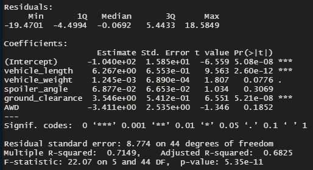
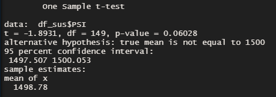
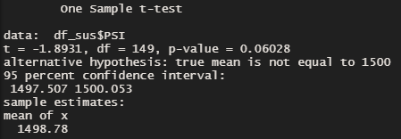
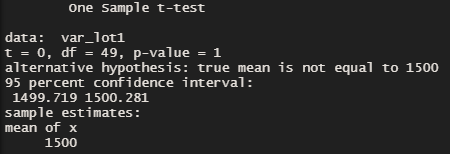
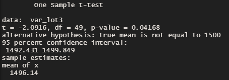

# Overview

In this project we performed several operations with R on car manufacturer data to find characteristics that directly impact MPG performance. 

We did the following:
1. Linear regression to predict MPG.
2. Sammarized statistics on suspension coils.
3. T-Test on supsension coils.
4. Designed a study comparing our "MechaCar" to competition.

## Linear Regression to Predict MPG

### Summary of Linear Regression

- Based on our linear regression, it would appear that the vehicle length and ground clearance had the most significant impact on mpg values.

- The R-squared value is over 0.7, therefore the slope is not zero and the null hypothesis can be rejected.

- The linear model does predict MPG effectively though not perfectly as the R-squared value is over 0.7.

## Summary Statistics on Suspension Coils

### Total Summary

### Lot Summary 

The design spec for our "MechaCar" indicated that the variance in the suspension coils should not exceed 100. From the summaries it was found that in total the parts are within the variance at 62.3. However, if we examine the individual lots we can see that Lot 3 is over the maximum variance at 170.3.

## T-Tests on Suspension Coils

### All Lot T-Test

### Lot 1 T-Test

### Lot 2 T-Test

### Lot 3 T-Test

Our t-test indicated that in total our dataset, as well as lot 1 and lot 2, had p-values over 0.05. This indicates that we cannot reject the null hypothesis and that the means are statistically similar to the population mean. However, lot 3 had a p-value of 0.04, meaning that we cannot reject the alternative hypothesis that there is statistical difference.

## Study Design: MechaCar vs Competition

To conduct a study to compare our Mechcar against competition, we must first decide which vehicle class our vehicle will fall under and which metrics will be the most important. For example, if we want to compete with a Challenger Hellcat, horsepower could be an important factor in quarter mile start time. However, increasing our horsepower could also negatively impact our fuel economy, which we verified in the coursework for this module. Things like cost, maintenance cost, and safety ratings are characteristics that would always be important for any type of vehicle. In our case, it would seem that our fuel economy is one of the more important metrics, therefore we should include vehicle length and ground clearance as items to improve as they had a significant impact on mpg. In our study we would use fuel economy, saftey rating, and cost as our dependent variables based on the information provided. 

To start, it would make sense to get consumer data for other cars in the same class. We could get this from somewhere like Kelly Blue Book. Then we would want to get the summary statistics and normal distribution and determine how competitors performed. This wouldnt necessarily show us correlations but might help us determine what a good goal would be if we want to compete against our top competiitors.

Assuming that we've gotten the population mean from our summary statistics, we could use t-tests to compare how other cars compared against the overall mean for each metric. Our null hypothesis would be that they perform statistically similarly to the population mean, our alternative would be that they deviate from our population mean.

We could then start looking at other metrics to see how they impact the metrics we determined. We've already found the car length and ground height have a significant effect on gas mileage, but other metrics including ones we've already looked at, like weight, may impact our cost and safety rating. Finding metrics that are important may take some data exploration, so it may take a few iteration of finding other characteristics that are important. It's also important to keep common sense in mind, for instance we would probably not want the car to close or far off the ground. Even it saves us a few cents at the pump.